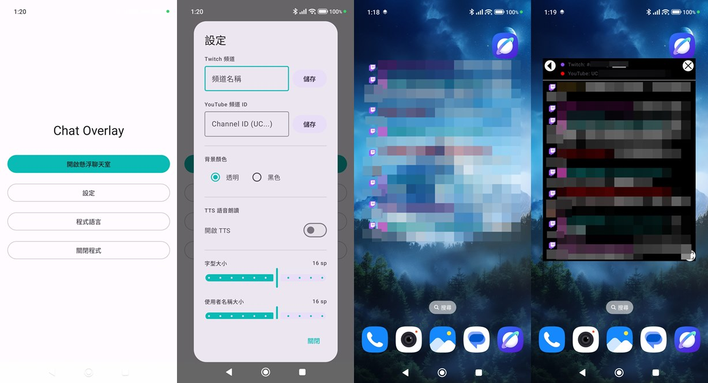
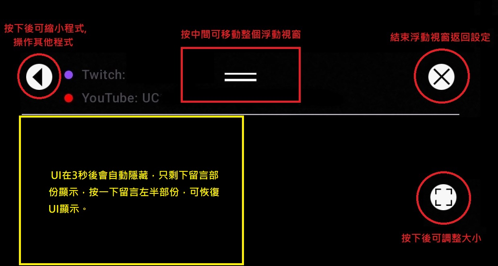
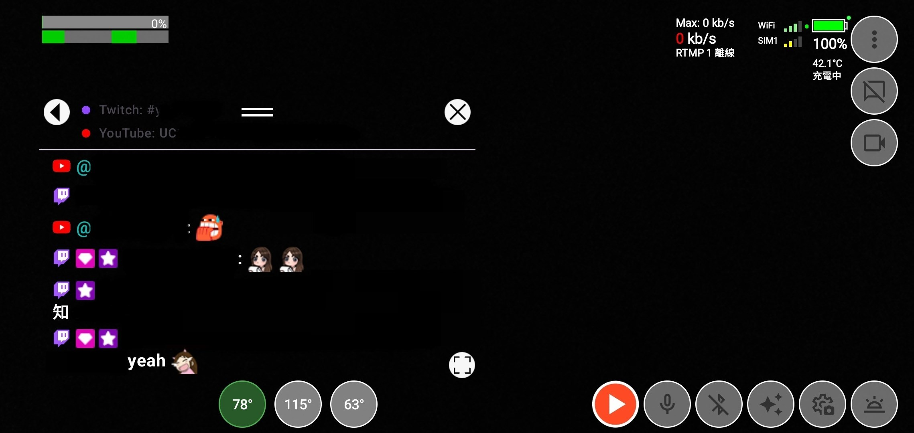
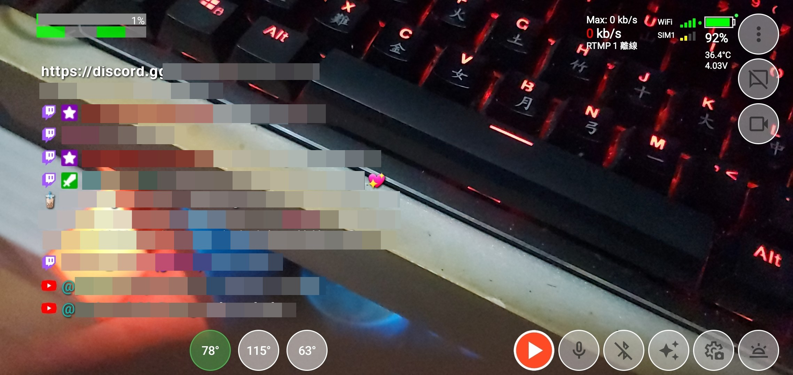

<h1>Chat Overlay</h1>

一個Android透明 Youtube/Twitch聊天室overlay給直播使用。
  

## [English](README_EN.md)
 
## 功能

- ✔️ Twitch、Youtube聊天室顯示。
- ✔️ Text-to-Speech聊天訊息朗讀。
- ✔️ 3種語言選擇，繁體中文、英文、日文。
- ✔️ 文字大小、行距、人名、表情符號大小可各自調較。
- ✔️ 透明聊天方塊可任意移動和調整大小。
- ✔️ UI在3秒後會自動隱藏，只剩下留言部份顯示，按一下留言左半部份，可恢復UI顯示。

## 使用方法
- UI介面按鍵說明。

- 配合其他直播軟件使用時的畫面。UI未消失時。

- UI消失後。

## 安裝方法
我會在 [GitHub releases](https://github.com/kongjjj/Chat-Overlay/releases) 內發布最新 .apk 檔案。

可以在手機上開啟 GitHub 發行頁面，下載 .apk 檔案並安裝。 

## 我製作的其他程式
- [Live Streaming Camera](https://github.com/kongjjj/Live-Streaming-Camera)：一個使用中文製作的Android直播程式。 

