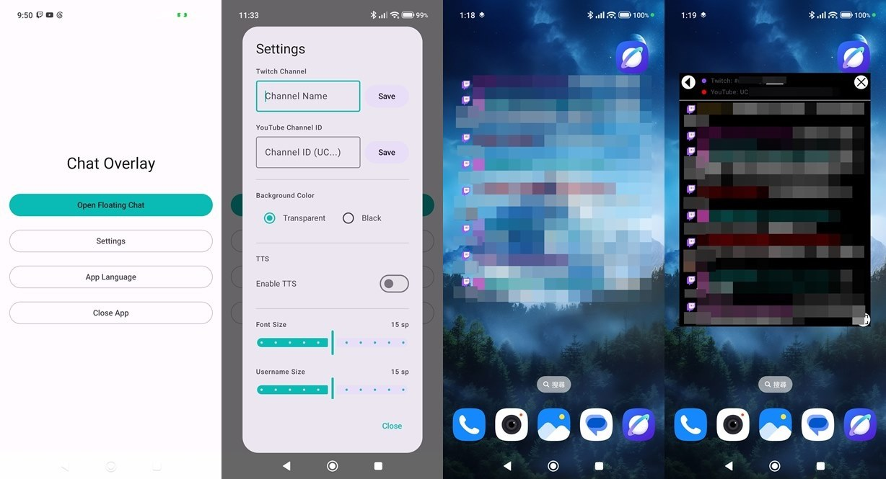
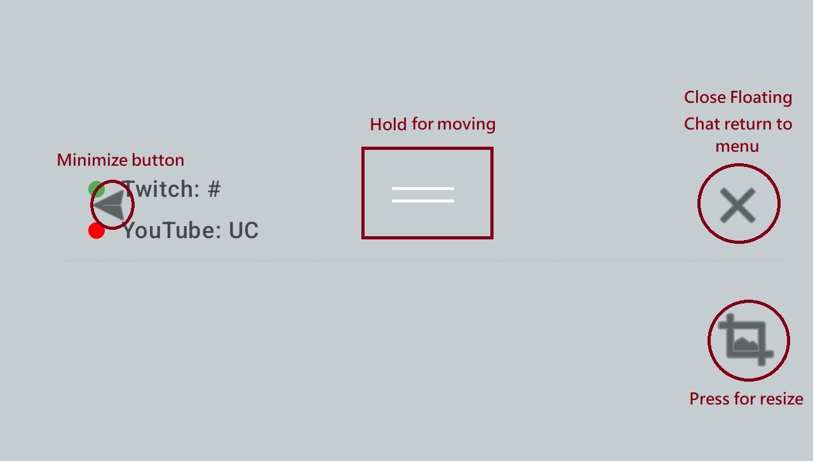

<h1>Chat Overlay</h1>

Android Transparent Youtube/Twitch Chat viewer app for IRL streaming.
  

## [Traditional Chinese](README.md)
 
## Features

- ✔️ Display in Twitch and YouTube chatrooms.
- ✔️ Text-to-Speech reading of chat messages.
- ✔️ 3 language options: Traditional Chinese, English, and Japanese.
- ✔️ Font size, line spacing, usernames, and emoji size can be adjusted individually.
- ✔️ The transparent chat box can be freely moved and resized.
- ✔️ The UI will automatically hide after 3 seconds, and only the comment section will remain visible. Clicking the left half of the comment section will bring back the UI.

## Usage

- The screen view when used with live streaming software.Before UI Disappears.

- After UI Disappears.

## Installation Method
I will publish the latest .apk file in the [GitHub releases](https://github.com/kongjjj/Chat-Overlay/releases) 

You can open the GitHub releases page on your phone, download the .apk file, and install it.

## Other projects I have made
- [Live Streaming Camera](https://github.com/kongjjj/Live-Streaming-Camera)：An Android live streaming app built using Chinese language.

